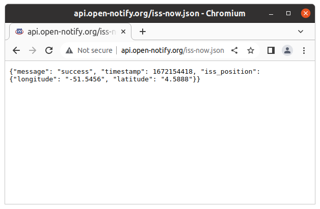

# Go Concurrency

---


<!-- _color: white -->

# Where is the ISS?



---

`app.go`

```go
package main

import (
    "io"
    "net/http"
)

func PrintISSPosition() {
    resp, _ := http.Get("http://api.open-notify.org/iss-now.json")
    body := resp.Body
    bytes, _ := io.ReadAll(body)
    fmt.Println(string(bytes))
}

func main() {
    PrintISSPosition()
}
```

---


```
$ go run app.go 
ISS Info: {"message": "success", "timestamp": 1672155304, 
"iss_position": {"longitude": "-13.8055", "latitude": "-37.7661"}}
```

---

```go
import (
    "fmt"
    "time"
)

...

func Compute() {
    for i := 1; i <= 10; i++ {
        time.Sleep(time.Second / 10)
        fmt.Print(i, " ")
    }
    fmt.Println("")
}

func main() {
    PrintISSPosition()
    Compute()
}

```

---

```
$ time go run app.go 
ISS Info: {"message": "success", "timestamp": 1672155760, 
"iss_position": {"longitude": "21.8250", "latitude": "-50.7057"}}
1 2 3 4 5 6 7 8 9 10 

real    0m1,710s
user    0m0,394s
sys     0m0,125s
```

---

## Start a GoRoutine

```go

func main() {
    go PrintISSPosition()
    Compute()
}

```

---

```
$ time go run app.go 
1 2 3 4 {"message": "success", "timestamp": 1672156095, 
"iss_position": {"longitude": "54.5906", "latitude": "-49.9492"}}
5 6 7 8 9 10 

real    0m1,318s
user    0m0,400s
sys     0m0,163s
```