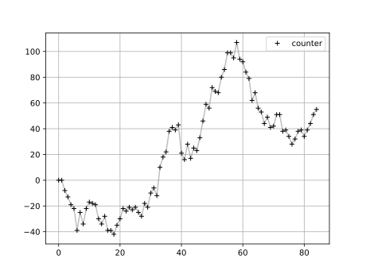

# Go Concurrency

---

## Goroutines 

💻 [A Tour of Go: Goroutines](https://go.dev/tour/concurrency/1)

```go
package main

import (
    "fmt"
    "time"
)

func say(s string) {
    for i := 0; i < 3; i++ {
        time.Sleep(100 * time.Millisecond)
        fmt.Println(s)
    }
}
```

----

### Serial execution

🚀 Execute

```go
func main() {
    say("hello")
    say("world")
}
```

---

### Concurrent Execution

🚀 Execute

```go
func main() {
    go say("hello")
    say("world")
}
```

---

`go says("hello")`:

  - is a **non-blocking** call: it returns "immediately",
    and doesn't wait for the completion of the function.

  - its gets executed: 
  
      - **in the background**,

      - in its own **lightweight process**

      - with its own **execution thread**

  - **concurrently** with `say("world")`

---

### 🧪 Experiment

🚀 Run the same code several times.

What's going on?

---


### ⚠️ Pitfall

  - 🎲 Concurrency $\to$ **non-determinism**

  - 🤔 Programs are harder to understand

  - 🪲 Beware the [Heisenbugs](Heisenbug)!

---

### 🩹 A Quick and Dirty Fix

Make sure that all messages are printed:

```go
func main() {
    go say("hello")
    say("world")
    time.Sleep(1 * time.Second)
}
```

--- 

### 🩹 A Proper Fix

WaitGroup 

```go
package main

import "sync"

func main() {
    wg := sync.WaitGroup{}
    wg.Add(1)
    go func() {
        say("hello")
        wg.Done()
    }()
    say("world")
    wg.Wait()
}
```

---

### Alternatively ... 

Use `WaitGroup` from the 🐚 [conc] library.

```go
package main

import "github.com/sourcegraph/conc"

func main() {
    wg := conc.WaitGroup{}
    wg.Go(func() {
        say("hello")
    })
    say("world")
    wg.Wait()
}
```

[conc]: https://github.com/sourcegraph/conc


---


### ⚠️ Data races

```go
package main

import "time"

var counter = 0

func add(i int) {
    counter += i
}


func main() {
    for {
        println(counter)
        // 🔨 Hammer the counter!
        for i := 0; i < 1000; i++ {
            go add(1)
            go add(-1)
        }
        // 😴 Let the dust settle
        time.Sleep(time.Second) 
    }
}
```

---

### 🤦 Ooops



---

## Shared Variables

  - In C/C++, you would use a 🔒 **lock** (mutex) to ensure that at most one process can access the `counter` variable at any given moment.

---

This also works in Go, but it's not idiomatic. Instead:

  > Don't communicate by sharing memory; 
  > share memory by communicating.

The core communication device is a **channel**.

---


## Channels

---

### Create

Channels are typed and (optionally) buffered:

```go
message := make(chan string, 1)

numbers := make(chan int, 10)

ready := make(chan bool) // same as make(chan bool, 0)
```

---

### Read & Write

```go
message <- "Hello world!"
s := <-message
fmt.Println(s)
```

```go
t := <-message // ⏳ blocked
```

```go
message <- "Hello"
message <- "world! // ⏳ blocked
```

---

```go
numbers <- 0
numbers <- 1
numbers <- 2
fmt.Println(<-numbers)
fmt.Println(<-numbers)
fmt.Println(<-numbers)
fmt.Println(<-numbers) // ⏳ blocked
```

---

Unbuffered channels seem useless at first sight

```go
ready <- true // ⏳
```

```go
status := <-ready // ⏳
```


---

... but they actually shine 

  - in a concurrent setting 
  
  - as a synchronisation mecanism!

----

### We're not ready yet

```go
package main

var ready = make(chan bool)

func Greetings() {
    for i:=0; i<10; i++ {
        fmt.Println("Hello world!")
    }
    ready <- true
} 

func main() {
    fmt.Println("begin")
    go Greetings()
    <-ready // Wait for the end!
    fmt.Println("end")
}

```

---

### Parallel Computations

```go
package main

var c = make(chan int, 2)

func sum(s []int) {
    sum := 0
    for _, v := range s {
        sum += v
    }
    c <- sum
}

func main() {
    s := []int{7, 2, 8, -9, 4, 0}
    go sum(s[:len(s)/2])
    go sum(s[len(s)/2:])
    x, y := <-c, <-c
    println(x, y, x+y)
}
```

---

### Throttling Process

```go
package main

func throttled(input chan string) chan string {
    output := make(chan string)
    go func() {
        for {
            output <- <-input
            time.Sleep(3 * time.Second)
        }
    }()
    return output
}

func main() {
    input := make(chan string)
    output := throttled(input)
    for i:=0; i<10; i++ {
        input <- "Hello world!"
        fmt.Println(<-output)
    }
}
```

---
### Sieve

```go
package main

func generate(ch chan int) {
    for i := 2; ; i++ {
        ch <- i
    }
}

func filter(in, out chan int, prime int) {
    for {
        i := <-in
        if i%prime != 0 {
            out <- i
        }
    }
}

func main() {
    ch := make(chan int)
    go generate(ch)
    for {
        prime := <-ch
        println(prime)
        ch1 := make(chan int)
        go filter(ch, ch1, prime)
        ch = ch1
    }
}
```

---


### ✌️ No more data races


Channels: safe to use concurrently

```go
var counter = 0
var ch = make(chan int, 2000)

func add(i int) {
    ch <- i
}

func counterHandler() {
    for {
        counter += <-ch
    }
}
```

---

```go
package main

func main() {
    go counterHandler() // ⚡ New!
    for {
        // 🔨 Hammer the counter!
        for i := 0; i < 1000; i++ {
            go add(1)
            go add(-1)
        }
        time.Sleep(time.Second) // 😴
        println(counter) // 📈
    }
}
```

---

### Timers

Sequential implementation of two concurrent processes:

```go
for {
    for i:=0; i < 10; i++ {
        // Executed at ~10Hz
        fmt.Println("FAST")
        time.Sleep(time.Second / 10) 
    }
    // Executed at ~1Hz
    fmt.Println("SLOW") 
}
```

---

Consider instead

```go
func Printer(m string, d time.Duration) {
    for {
        fmt.Print(m)
        time.Sleep(d)
    }
}

func main() {
    go Printer("FAST", time.Second / 10)
    Printer("SLOW", time.Second)
}
```

---

Even better

```go
package main

func Printer(m string, d time.Duration) {
    for {
        wait := time.After(d)
        fmt.Println(m)
        <-wait
    }
}

func main() {
    go Printer("FAST", time.Second / 10)
    Printer("SLOW", time.Second)
}
```

or use the [`time` module](https://pkg.go.dev/time)  `Ticker` & `Timer` API!

---


```go
package main

import "time"

func HappyNewYear(year int) chan struct{} {
    trigger := make(chan struct{})
    newYear := time.Date(
        year, time.January,
        0, 0, 0, 0, 0, time.UTC)

    go func() {
        for {
            if time.Now().After(newYear) {
                trigger <- struct{}{}
                return
            }
            time.Sleep(time.Second)
        }
    }()

    return trigger
}

func main() {
    <-HappyNewYear(2025)
    println("🥳 Happy New Year!")
}
```

<!--

## TODO

  - Mention Actor model ("Subject" vs "Object")

-->